# 🎯 QuizHunt

**QuizHunt** is a modern and interactive quiz application designed to test your knowledge in various programming topics.  
Built with **React, Tailwind CSS, Redux, and React Router**, it offers a smooth user experience with dynamic state management, dark mode, and multi-language support.

🚀 **Live Demo:** [QuizHunt](https://nomaan-07.github.io/QuizHunt/)

---

## 🛠️ Tech Stack

- ⚛ **React** – Component-based UI
- 🎨 **Tailwind CSS** – Modern styling
- 🚏 **React Router** – Seamless navigation
- 🏪 **Redux** – Efficient state management

---

## 📌 Features

✅ **Multi-language support** (English 🇺🇸 & Persian 🇮🇷)  
✅ **Dark mode** for a better user experience 🌙  
✅ **Custom quiz settings** – Choose category & number of questions  
✅ **Multiple quiz topics** – HTML, CSS, JS, React & more  
✅ **Real-time progress tracking** – Timer, score, and progress bar  
✅ **Dynamic result calculation** – See your final score & correct answers  
✅ **Fully responsive design** – Works on all devices 📱💻  
✅ **Static Questions** – Questions are stored locally in the `/src/data` folder (no backend API)

---

## 🖥️ App Overview

### 🌍 **Home Page**

- Users can switch between **dark mode** and different **languages**.
- "Let's Go" button navigates to the **Quiz Settings** page

### ⚙️ **Quiz Settings**

- Select quiz **category** (HTML, CSS, JS, React, etc.)
- Choose **number of questions**
- Start the quiz with the **Start Quiz** button

### ❓ **Quiz Page**

- Displays **question & multiple-choice answers**
- Includes **timer, points, and a progress bar**
- Buttons to **go to the next question** or **finish the quiz**

### 🏆 **Result Page**

- Shows **final score & number of correct answers**
- "Restart Quiz" button redirects to **Home Page**

---

## 📸 Screenshots

### 🌞 Light Mode

#### 🏠 Home Page

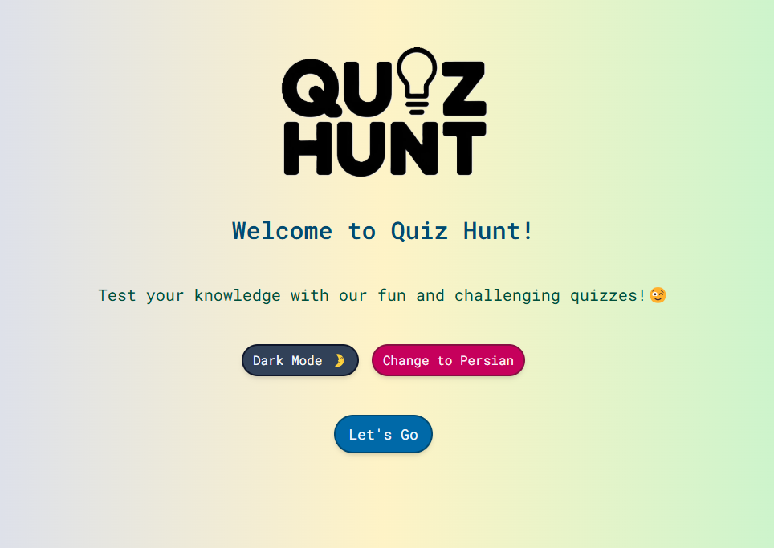

#### ⚙️ Settings Page

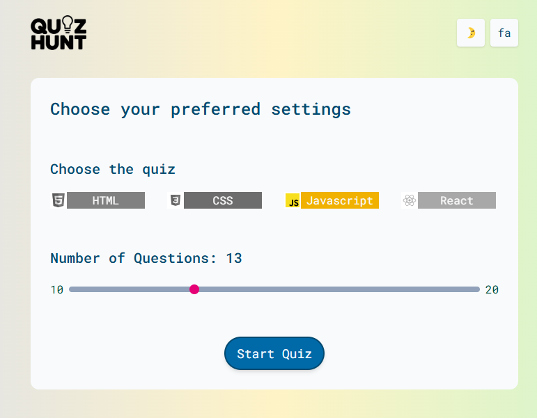

#### ❓ Quiz Page

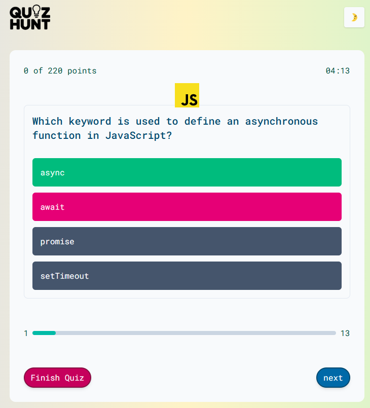

#### 🏆 Result Page

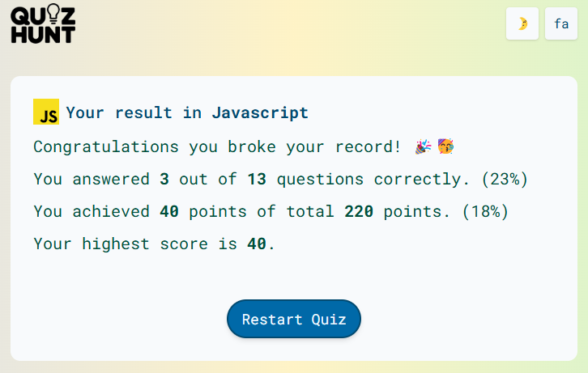

---

### 🌙 Dark Mode

#### 🏠 Home Page

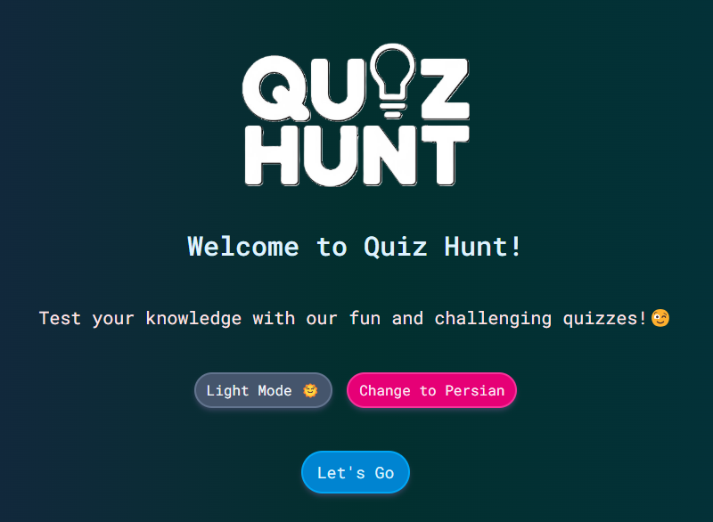

#### ⚙️ Settings Page

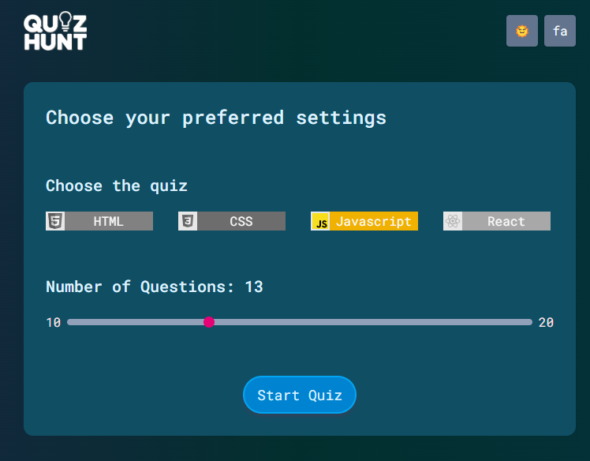

#### ❓ Quiz Page

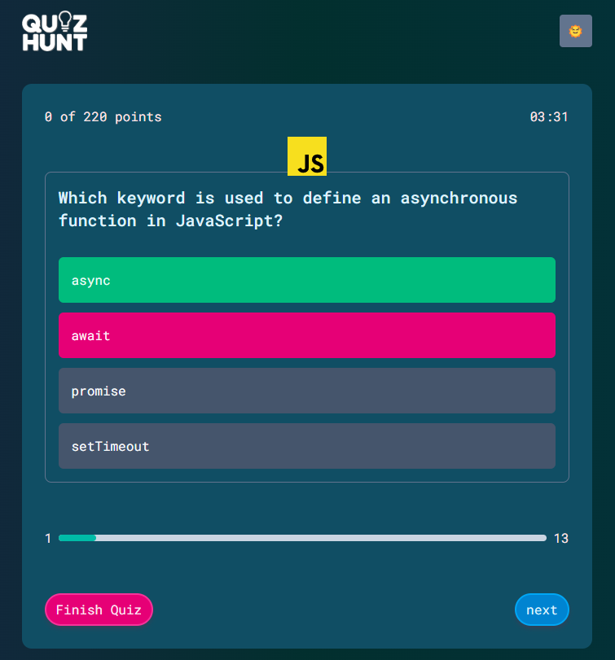

#### 🏆 Result Page

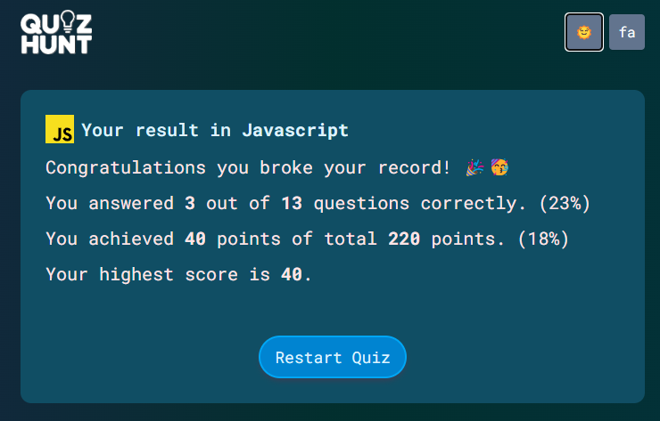

---

### 🇮🇷 Persian (FA) Language

#### 🏠 Home Page

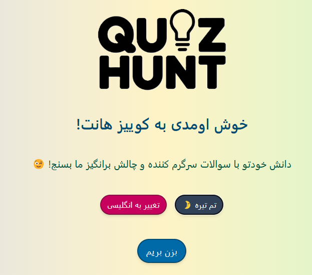

#### ⚙️ Settings Page

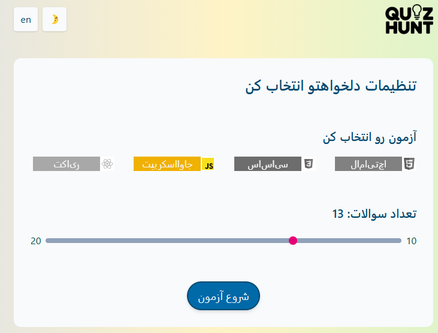

#### ❓ Quiz Page

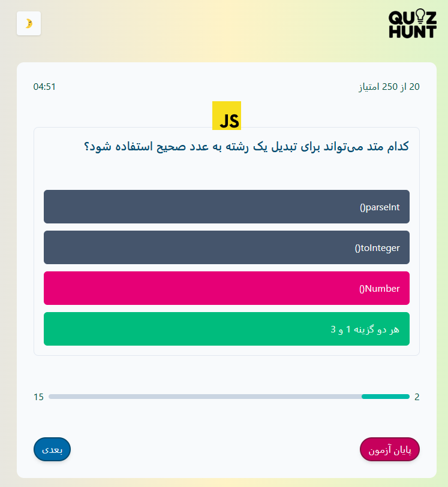

#### 🏆 Result Page

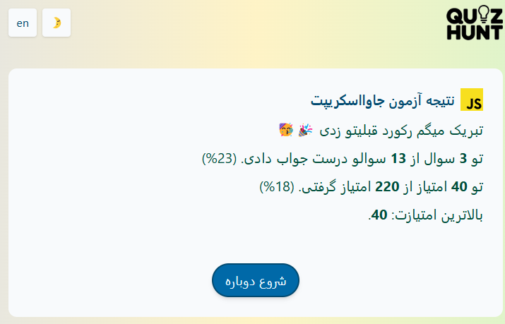

---

## 📜 License

This project is licensed under the **MIT License** – see the [LICENSE](LICENSE) file for details.

---

💡 **Developed with ❤️ by Nomaan**
